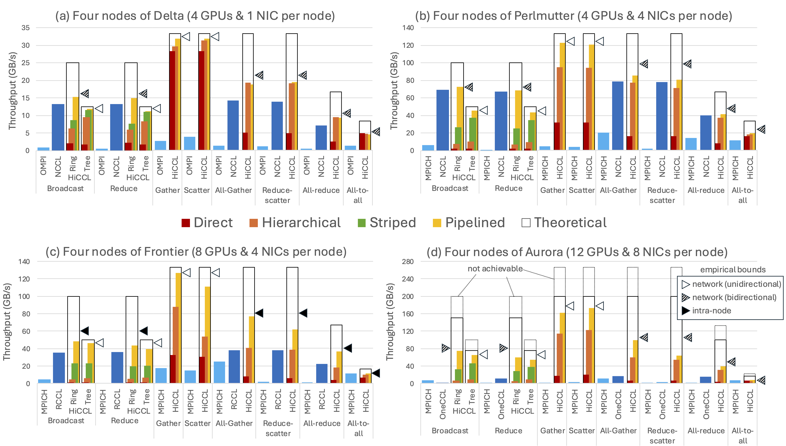

# HiCCL

HiCCL is a compositional communication library for hierarchical GPU networks. It offers an API for composing collective functions using *multicast*, *reduction*, and *fence* primitives. These primitives are machine- and library-agnostic, and are defined across GPU endpoints. HiCCL's design principle is to decouple the higher-level communication design and machine-specific optimizations. This principle aims to improve productivity, portability, and performance when building custom collective functions.


HiCCL is based on [CommBench](https://github.com/merthidayetoglu/CommBench): a micro-benchmarking software for HPC networks. While HiCCL is a C++ layer for generating communication patterns on an abstract machine, CommBench is the middleware for implementing the patterns on an actual machine. The implementation is achieved by using the point-to-point functions of the chosen communication library, MPI, NCCL, RCCL, and OneCCL, and IPC capabilities (e.g., put, get), and recently GASNet-EX RMA functions for non-MPI applications.

## API

The collective function is built within a persistent communicator. As an example, below shows an in-place composition of the All-Reduce collective.

```c++
#define PORT_CUDA
#include "hiccl.h"

#define T float;

using namespace HiCCL

int main() {

  size_t count = 1e9 / sizeof(T); // 1 GB

  Comm<T> allreduce;

  T *sendbuf;
  T *recvbuf;
  allocate(sendbuf, count * numproc);
  allocate(recvbuf, count * numproc);

  // partial reductions (each GPU gathers count elements from all GPUs for reduction)
  for (int i = 0; i < numproc; i++)
    allreduce.add_reduction(sendbuf + i * count, recvbuf + i * count, count, HiCCL::all, i);
  // express ordering of the primitives
  allreduce.add_fence();
  // multicast partial results (each GPU sends count elements to all GPUs except itself)
  for (int i = 0; i < numproc; i++)
    allreduce.add_multicast(recvbuf + i * count, recvbuf + i * count, count, i, HiCCL::others);

  // optimization parameters
  std::vector<int> hierarchy = {numproc / 12, 6, 2}; // hierarchical factorization
  std::vector<library> lib = {MPI, IPC, IPC}; // implementation libraries in each level
  int numstripe(1); // multi-rail striping (off)
  int ring(1); // number of virtual ring nodes (off)
  int pipeline(count / (1e6 / sizeof(T))); // MTU: 1 MB

  // initialize
  allreduce.init(hierarchy, lib, numstripe, ring, pipeline);

  // repetetive communications
  for (int iter = 0; iter < numiter; iter++) {
    // ...
    // nonblocking start
    allreduce.start();
    // ... overlap other things
    // blocking wait
    allreduce.wait();
    // ...
  }
}

```



For questions and support, please send an email to merth@stanford.edu
